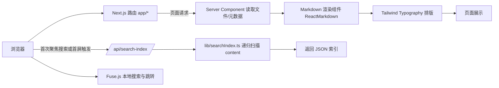
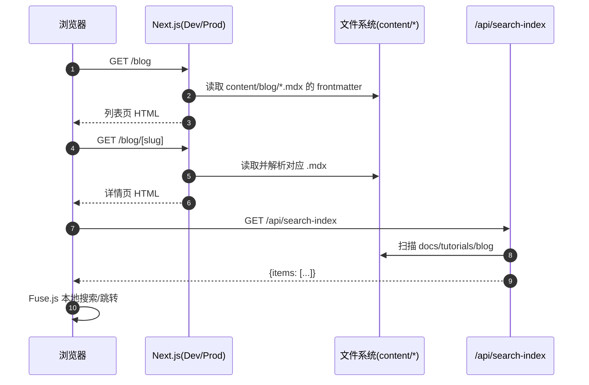

太棒了！你有非常扎实的 C 和 Linux 背景，这对于学习后端技术和部署是非常大的优势。你对系统底层有深入的理解，这将帮助你更快地掌握 Node.js 的工作原理。你的目标非常明确：**用 MVP (Minimum Viable Product) 方案快速构建 SaaS 应用并推向市场**。

考虑到你的背景和目标，我为你设计了一个为期 8-12 周的“速成”学习计划。这个计划的重点是**实践和目标导向**，而不是深入每一个技术的细枝末节。

---

### **面向 SaaS 全栈工程师的 MVP 速成学习计划**

**核心理念：**
*   **TypeScript 优先：** 你来自强类型的 C 语言，直接学习 TypeScript 会比学习动态的 JavaScript 更顺手，也能发挥类型安全的优势。
*   **框架驱动：** 利用现代全栈框架（如 Next.js）来简化开发，让你专注于业务逻辑而非繁琐的配置。
*   **实践出真知：** 每个阶段都伴随着一个可运行的小项目，最终汇合成你的 MVP。

---

#### **第一阶段：基础转型 (1-2 周)**

**目标：** 从 C/Linux 思维切换到现代 Web 开发思维，掌握核心语言特性。

1.  **JavaScript 核心要点 (3-4 天):**
    *   **异步编程：** 这是最大的思维转变。重点理解 `Promise` 和 `async/await`。这与 C 的同步阻塞模型完全不同。
    *   **ES6+ 语法：** 学习箭头函数 `=>`、`let/const`、解构赋值、模板字符串。
    *   **数据结构：** 熟悉 `Object` (类似 C 的 struct/map) 和 `Array` 的常用方法 (`.map`, `.filter`, `.reduce`)。
    *   **模块化：** 理解 `import` 和 `export`。

2.  **TypeScript 快速入门 (1 周):**
    *   **环境搭建：** 安装 Node.js 和 npm/pnpm，配置 `tsconfig.json`。
    *   **核心类型：** 学习基本类型 (`string`, `number`, `boolean`)、数组、对象。
    *   **`interface` 和 `type`：** 这是 TypeScript 的精髓。用它们来定义你的数据结构，就像在 C 中定义 `struct` 一样。
    *   **函数类型：** 为函数参数和返回值添加类型。
    *   **泛型 (Generics):** 你的 C 背景会让你很容易理解这个概念。

**产出：** 一个可以用 `ts-node` 运行的命令行小工具，例如一个简单的任务管理器，用来练习 TS 语法和异步文件操作。

---

#### **第二阶段：后端核心 (2-3 周)**

**目标：** 构建 SaaS 应用的后端 API 和数据库。

1.  **Node.js 与 Express/Fastify (1 周):**
    *   学习使用 **Express.js** (或更现代的 Fastify) 框架来创建 HTTP 服务器。
    *   **路由 (Routing):** 如何处理不同的 URL 请求 (e.g., `/api/users`, `/api/products`)。
    *   **中间件 (Middleware):** 理解其中间件的概念，用于处理认证、日志等。

2.  **数据库与 Prisma (1-2 周):**
    *   **数据库选择：** 对于 MVP，推荐使用 **PostgreSQL**。
    *   **ORM 选择：** 强烈推荐 **Prisma**。它是一个现代的 ORM，与 TypeScript 完美集成，能提供端到端的类型安全，让你感觉像在写 TS 一样操作数据库。
    *   **学习要点：**
        *   用 Prisma Schema 定义数据模型。
        *   执行 `prisma migrate` 来创建和更新数据库表结构。
        *   使用 Prisma Client 在你的 API 中进行增删改查 (CRUD) 操作。

**产出：** 一个可以提供用户注册、登录 (使用 JWT) 和数据增删改查功能的 RESTful API。你可以用 Postman 或 Insomnia 等工具来测试它。

---

#### **第三阶段：前端与全栈框架 (3-4 周)**

**目标：** 构建用户能直接交互的前端界面，并将前后端整合。

1.  **HTML & CSS 快速过关 (3-4 天):**
    *   了解 HTML 标签的基本语义。
    *   学习 CSS 核心概念：Flexbox 和 Grid 布局。
    *   **工具优先：** 不要花太多时间手写 CSS。直接上 **Tailwind CSS**，它是一个功能优先的 CSS 框架，能让你极快地构建出漂亮的界面，非常适合 MVP。

2.  **React 与 Next.js (2-3 周):**
    *   **为什么是 Next.js?** 它是基于 React 的全栈框架，能让你在同一个项目中编写前端和后端代码 (API Routes)，极大简化了 MVP 的开发和部署。
    *   **React 核心：**
        *   **组件化思维：** 将 UI 拆分成可复用的组件。
        *   **State 和 Props：** `useState` (管理组件内部状态) 和 `useEffect` (处理副作用，如 API 请求)。
    *   **Next.js 核心：**
        *   **页面路由：** 文件系统即路由，非常直观。
        *   **API Routes：** 在 `pages/api` 目录下直接编写后端接口。
        *   **数据获取：** `getServerSideProps` (SSR) 和 `getStaticProps` (SSG)。

**产出：** 一个使用 Next.js 和 Tailwind CSS 构建的 Web 应用。它能调用你在第二阶段写的 API (或者直接用 Next.js 的 API Routes)，实现用户登录、展示数据、进行操作等核心功能。

---

#### **第四阶段：部署与上线 (1-2 周)**

**目标：** 将你的 MVP 部署到线上，让全球用户可以访问。

1.  **Docker 容器化 (3-4 天):**
    *   你的 Linux 经验在这里将大放异彩。
    *   为你的 Next.js 应用编写 `Dockerfile`。
    *   使用 `docker-compose` 在本地模拟生产环境。

2.  **选择部署平台：**
    *   **Vercel (强烈推荐):** Next.js 的母公司，提供对 Next.js 项目的“一键部署”，免费套餐对 MVP 非常友好。你只需要将代码推送到 GitHub，Vercel 会自动完成构建和部署。
    *   **Render / Fly.io:** 如果你想部署 Docker 容器，这两个平台是不错的选择，性价比高。
    *   **云服务器 (AWS, DigitalOcean):** 如果你想完全掌控服务器，可以租用一台 VPS，利用你的 Linux 技能手动部署。

3.  **CI/CD (持续集成/持续部署):**
    *   学习使用 **GitHub Actions**。设置一个简单的工作流，当你推送代码到主分支时，自动运行测试并部署到 Vercel 或其他平台。

**产出：** 你的 SaaS 应用成功上线，拥有一个可以公开访问的 URL！

---

**给你的建议：**
*   **保持专注：** 技术栈很多，但 MVP 阶段，坚持使用 **Next.js + TypeScript + Prisma + Tailwind CSS + Vercel** 这个组合，它们是为快速迭代而生的。
*   **利用 AI：** 在学习和编码过程中，随时向我或其他 AI 工具提问，可以帮你解决很多卡点问题。
*   **先完成，再完美：** 不要陷入细节。MVP 的核心是验证市场，功能能用就行。

这个计划强度比较大，但以你的工程背景和明确的目标，是完全可以实现的。祝你成功出海，赚取美金！


---
## 第一阶段
非常好，这种分阶段、求甚解的学习方式非常适合工程师。我们来详细拆解第一阶段的学习计划。

### **第一阶段：基础转型 (预计 1-2 周)**

**总目标：** 克服从 C/Linux 同步、编译型语言到 JavaScript/TypeScript 异步、解释型语言的思维鸿沟。掌握能让你读懂并写出基本 Web 应用代码的核心语言特性。

**核心学习策略：**

*   **类比学习法：** 你有 C 的基础，这是巨大优势。我会帮你把 TS/JS 的概念与 C 的概念进行类比（例如 `interface` vs `struct`），加速你的理解。
*   **抛弃“精通”包袱：** MVP 开发不需要你成为语言专家。我们的目标是“够用”，能快速解决问题。遇到不懂的，先查资料解决，不要陷入研究的牛角尖。
*   **编码驱动，而非看课驱动：** 每天至少花 60% 的时间在写代码上。打开 VS Code，或者使用 [TypeScript Playground](https://www.typescriptlang.org/play) 这种在线工具，即时验证你的想法。
*   **关注“异步”：** 这是你面临的最大挑战。把理解“事件循环 (Event Loop)”和 `async/await` 作为本阶段最重要的任务。

---

### **第一部分：JavaScript 核心要点 (预计 3-4 天)**

这部分的目标是快速扫清 JS 的核心障碍，为学习 TS 铺路。

| 主题 | 学习计划 | 学习策略与C类比 | 掌握程度检验 |
| :--- | :--- | :--- | :--- |
| **1. 异步与事件循环** | 1. 学习 Node.js 或浏览器如何通过单线程事件循环处理并发。2. 编写 `setTimeout` 和 `setInterval`，直观感受代码不按顺序执行。 | **策略：** 忘掉 C 的多线程和阻塞 `sleep()`。把 JS 想象成一个不断从任务队列里取任务执行的循环。`setTimeout` 只是把一个新任务“预约”到未来的队列里，而不是让程序“暂停”。 | 能向一个不懂编程的人解释，为什么 `console.log('A'); setTimeout(() => console.log('B'), 0); console.log('C');` 会打印出 `A, C, B`。 |
| **2. ES6+ 核心语法** | 1. 变量声明：`let` (块级作用域变量) 和 `const` (常量)。2. 函数：箭头函数 `(a, b) => a + b`。3. 字符串：模板字符串 `` `Hello, ${name}` ``。4. 结构：数组和对象的解构赋值。 | **策略：** `const` 类似于 C 的 `const` 指针，指向的内存地址不变，但如果指向的是对象，对象内部的属性可变。箭头函数是 C 中函数指针的超级进化版。 | 拿到一段旧式的 JS 代码，能用 ES6+ 语法将其重构得更简洁。 |
| **3. 核心数据结构** | 1. **数组 (Array):** 重点掌握 `.map()`, `.filter()`, `.reduce()`, `.forEach()` 这四个高阶函数。2. **对象 (Object):** 理解其作为键值对集合的用法。 | **策略：** 把 JS 数组想象成一个功能极其强大的动态数组。`.map()` 和 `.filter()` 是你在 C 中需要手写循环才能实现的功能的快捷方式。对象可以看作是 C 的 `struct` 和 `hashmap` 的混合体。 | **场景题：** 给定一个包含用户对象的数组 `[{id: 1, name: 'A', age: 25}, {id: 2, name: 'B', age: 30}]`，你能否用一行代码筛选出所有年龄大于 25 岁的用户的名字？(答案: `users.filter(u => u.age > 25).map(u => u.name)`) |
| **4. Promise 与 async/await** | 1. 简单理解 `Promise` 是一个代表未来某个时刻才会完成的操作的对象，有 `.then()` (成功) 和 `.catch()` (失败) 两个回调。2. **重点掌握 `async/await`**，它是 Promise 的语法糖，能让你用类似同步代码的风格写异步代码。 | **策略：** 这是本部分最重要的内容。把任何异步操作（如读文件、网络请求）都看作一个会立即返回 `Promise` 对象的函数。使用 `await` 关键字，就可以“暂停”函数执行，等待这个 `Promise` 完成，并拿到结果，就像在 C 里调用一个阻塞函数一样。所有 `await` 都必须在 `async` 函数内。 | 能写一个 `async` 函数，它使用 `try...catch` 结构来处理一个可能会失败的、用 `setTimeout` 模拟的异步操作。 |

---

### **第二部分：TypeScript 快速入门 (预计 1 周)**

| 主题 | 学习计划 | 学习策略与C类比 | 掌握程度检验 |
| :--- | :--- | :--- | :--- |
| **1. 环境与基础类型** | 1. 安装 Node.js，使用 `npm install -g typescript`。2. 创建项目，`tsc --init` 生成 `tsconfig.json`。3. 学习 `string`, `number`, `boolean`, `any`, `unknown` 等基本类型。 | **策略：** `tsconfig.json` 类似于 `Makefile`，定义了编译规则。`any` 类型要避免使用，它会让你失去 TS 的类型保护。 | 能成功编写一个 `hello.ts` 文件，用 `tsc` 命令将其编译成 `hello.js`，然后用 `node hello.js` 成功运行。 |
| **2. 定义数据结构** | 1. **`interface`**: 用来定义对象的“形状”。2. **`type`**: 用来创建类型别名。 | **策略：** **这是你最需要关注的地方！** 把 `interface` 完全等同于 C 的 `struct` 来理解。`interface User { id: number; name: string; }` 就约等于 `struct User { int id; char* name; };`。 | 能为一个复杂的对象（例如，一个包含用户基本信息和订单列表的“客户”对象）创建对应的 `interface`。 |
| **3. 函数与泛型** | 1. 为函数参数和返回值添加类型。2. 学习泛型 `<T>` 来创建可重用的、类型安全的函数。 | **策略：** C 语言的函数指针和宏在某种程度上可以类比泛型，但 TS 的泛型要强大和安全得多。它允许你编写一个函数，其参数和返回值的类型是动态的，但在调用时又是类型确定的。 | 能独立写出一个泛型函数，例如 `function wrapInArray<T>(input: T): T[] { return [input]; }`，并理解为什么它比 `function wrap(input: any): any[]` 更好。 |

---

### **第一阶段项目实践：CLI 待办事项应用 (CLI-Todo)**

这个项目将检验你第一阶段的所有学习成果。

**项目描述：**
创建一个在命令行中运行的待办事项管理工具。

**核心功能：**
1.  `node todo.js add "晚上 8 点学习 React"`：添加一个新任务。
2.  `node todo.js list`：列出所有任务，并显示其 ID 和完成状态。
3.  `node todo.js done 2`：将 ID 为 2 的任务标记为已完成。
4.  `node todo.js remove 2`：删除 ID 为 2 的任务。

**技术栈：**
*   **语言：** TypeScript
*   **运行环境：** Node.js
*   **数据存储：** 使用 Node.js 内置的 `fs` (File System) 模块，将任务列表以 JSON 格式读写到一个本地文件 (`tasks.json`) 中，以此模拟简单的数据库操作。

**如何检验你的学习成果：**
*   你必须使用 `interface Task { ... }` 来定义任务的数据结构。(**检验 TS 结构定义**)
*   所有对 `tasks.json` 文件的读写操作都是异步的，你必须使用 `async/await` 来处理。(**检验异步编程**)
*   在 `list`, `done`, `remove` 功能中，你会大量使用数组的 `.map`, `.filter`, `.find` 等方法来操作任务列表。(**检验数据结构操作**)
*   你需要解析 `process.argv` 来获取用户输入的命令和参数。(**检验 Node.js 基础**)

完成这个小项目，你就可以自信地说，你已经成功从 C/Linux 的世界迈出了进入 TS/JS 全栈开发的第一步。

这个计划是否清晰？如果满意，我们可以随时开始，或者对计划进行调整。

---
## AI 工具
[[gemini & CC]]


## 提示词

目标
- 构建一款「嵌入式 Linux 学习网站」，主页整体 UI/UX 贴近 vercel.com 首页的极简、留白、深色优先与微交互风格。
- 定位：从入门到进阶，覆盖 Bootloader、设备树、内核模块、交叉编译、驱动、Yocto/Buildroot、系统服务等主题，强调实战与体系化。

技术栈与基础
- 框架：Next.js 14（App Router，RSC），TypeScript
- 样式：Tailwind CSS + CSS 变量（深色优先），内置 Geist 字体与几何网格/光晕/霓虹微发光效果
- 内容：MDX 驱动（Contentlayer 或 Nextra 风格的自建系统），支持侧边栏 TOC、锚点、代码块复制、内联提示
- 动效：Framer Motion（轻量微交互）
- 资源：next/image 与字体优化；尽量 Edge Runtime；内置 `@vercel/analytics`
- 语言：中文优先，可扩展 i18n（zh-CN 起步）

信息架构
- 首页（Vercel 风格）：Hero（极简标语 + 次要副标题 + CTA）、优势/能力栅格区、课程/学习路径卡片区、精选案例/展示区、社区/星标/更新动态区、页脚多列导航
- 文档/教程：`/docs`（左侧目录树 + 右侧 TOC）、`/tutorials`（分阶段学习路径卡）
- 实战实验室：`/labs`（实验任务卡 + 环境准备/验证步骤）
- 博客更新：`/blog`
- 关于/支持：`/about`、`/resources`（资料/链接）
- 搜索：站内搜索（预留 Algolia DocSearch 接入点）
- 404、隐私、条款

关键组件（复用与主题化）
- 导航栏：极简、透明渐变、滚动吸顶、移动端抽屉
- Hero：渐变标题/高对比排版、描述、主/次 CTA、背景噪点/网格/光晕
- 特性卡片：玻璃拟物 + 轻光晕边、悬停微动效
- 代码/终端演示：带标题栏、复制按钮、可切 Tab 的代码块；终端风演示（模拟命令/输出）
- 文档布局：左侧树、右侧 TOC、中间内容、返回顶部、锚点高亮
- 提示块：Info/Warning/Success/Note（带图标与可折叠）
- 页脚：多列链接、版权、社媒、开源入口

视觉规范
- 深色优先：`#0A0A0A` 基底，灰阶中性色 + 品牌高光渐变（如青蓝/紫蓝）
- 背景：网格线 + 微弱噪点 + 渐变光晕（GPU-friendly）
- 排版：Geist Sans/Mono；大字号标题 + 紧凑正文；卡片圆角与柔和阴影
- 微交互：悬停轻位移/缩放/发光、进入渐显；优先性能与连贯性

内容样例与结构（需落地）
- `docs`：入门（嵌入式概念/工具链/交叉编译）、系统启动（Bootloader、设备树）、内核（配置/编译/模块/驱动）、用户空间（BusyBox、systemd、udev）、构建（Buildroot/Yocto）、调试（串口/JTAG/日志/常见坑）
- `tutorials`：循序渐进任务（每篇包含前置条件、目标、步骤、验证、常见错误）
- 代码块：均为可复制命令与片段（bash/c/cmake/dts 等），提供输入与典型输出示例

性能与 SEO
- Lighthouse ≥ 95（移动/桌面），首屏 JS 负载控制，路由级 code-split
- next/font 与字体子集化；图片懒加载；OG 图自动生成；站点地图/robots/元信息齐全

无障碍与可用性
- 对比度合规、键盘可达、语义标签、跳转链接、可读 TOC 锚点

交付要求（输出格式）
- 生成一个可运行的 Next.js 14 项目（App Router + TS），文件/目录齐全：`app/*`、`content/docs/*`、`content/blog/*`、`components/*`、`styles/*`、`lib/*`、配置文件完整
- 内置若干示例文档/教程/博客，确保路由与导航联动正常
- README（安装/开发/构建/部署/内容拓展指引）
- 提供 Theme Token 与 `tailwind.config` 主题扩展
- 提供基本单测（至少关键布局与组件快照）

验收标准
- 首页观感与交互贴近 vercel.com 首页气质（不是一比一，但风格明确）
- 文档区可正常侧边导航、锚点跳转、代码复制
- 性能分数达标，首屏渲染与交互流畅
- 所有页面深色模式观感一致，微动效不喧宾夺主
- 代码结构清晰、可扩展，易于继续填充内容

## 项目框架
### 目标
- 用本项目快速掌握并实操当前主流的 Next.js 全栈技术栈，做出最小可用产品（MVP），支持内容发布与站内搜索，便于出海迭代。

## 项目目录速览
```text
emb_linux_website/
- app/                         # 路由与页面（Next.js App Router）
  - page.tsx                   # 首页（Server Component）
  - layout.tsx                 # 全局布局（导航/页脚/样式注入）
  - api/search-index/route.ts  # API 路由：返回搜索索引(JSON)
  - blog/page.tsx              # 博客列表（读取 content/blog）
  - blog/[slug]/page.tsx       # 博客详情（动态路由）
  - docs/...                   # 文档索引与详情
  - tutorials/...              # 教程索引与详情
  - not-found.tsx              # 404
- components/
  - Search.tsx                 # 客户端搜索组件（Fuse.js）
  - Markdown.tsx               # Markdown 渲染（react-markdown + remark/rehype）
  - CodeBlock.tsx              # 代码块 + 复制按钮
- content/                     # 站点内容（MD/MDX）
  - blog/*.mdx
  - docs/**.mdx
  - tutorials/*.mdx
- lib/
  - searchIndex.ts             # 递归扫描 content/* 构建搜索索引
  - format.ts                  # 日期格式化
- styles/ or app/globals.css   # Tailwind 全局样式（本项目放在 app/globals.css）
- public/                      # 静态资源
- tailwind.config.ts           # Tailwind 配置（已启用 typography 插件）
- next.config.mjs              # Next.js 配置（14.x）
- package.json                 # 脚本与依赖
```

## 技术栈总览（做什么、为什么、怎么用）
- React 18
  - 做什么：写 UI 组件，声明式渲染。
  - 为什么：生态成熟、与 Next.js 深度集成。
  - 怎么用：`.tsx` 文件写组件（JSX 语法），客户端组件须在首行写 `use client`。
- Next.js 14（App Router + RSC）
  - 做什么：文件即路由、服务端渲染（SSR）、静态生成（SSG）、API 路由。
  - 为什么：统一前后端、极佳开发体验，适合内容站和 MVP。
  - 怎么用：`app/*` 下的 `page.tsx`/`route.ts` 自动成为页面/API；默认是 Server Component，浏览器端交互组件改为 Client Component。
- TypeScript
  - 做什么：类型检查，减少运行时错误。
  - 为什么：增强可维护性与可读性。
  - 怎么用：无 JSX 用 `.ts`，有 JSX 用 `.tsx`；配置在 `tsconfig.json`。
- Tailwind CSS + @tailwindcss/typography
  - 做什么：原子化 CSS；`prose` 类让 Markdown 文章排版优雅。
  - 为什么：开发快、样式一致；贴近 Vercel 极简风。
  - 怎么用：在 JSX 上写类名，如 `className="rounded-xl border border-white/10"`；文章容器用 `prose prose-invert`。
- Markdown 渲染（react-markdown + remark-gfm + rehype-slug + autolink）
  - 做什么：把 `content/*` 里的 MD/MDX 转 HTML 渲染，支持 GFM（表格、任务列表），为标题自动加锚点。
  - 为什么：内容生产高效，工程与内容解耦。
  - 怎么用：`components/Markdown.tsx` 统一渲染字符串内容。
- 内容 Frontmatter（gray-matter）
  - 做什么：在 `.mdx` 顶部用 YAML 写 `title`、`date`、`description` 等元数据。
  - 怎么用：文件开头写：
    ```md
    ---
    title: 标题
    date: "2025-08-12"    # 建议加引号，避免被当作 Date 对象
    description: 摘要
    ---
    ```
- 站内搜索（Fuse.js + 本地索引）
  - 做什么：模糊搜索站内文档/教程/博客。
  - 怎么用：前端 `components/Search.tsx` 首次使用时从 `/api/search-index` 拉索引；Fuse 在浏览器内搜索，响应快、不依赖外网。
- Node 内置 API 路由
  - 做什么：`/api/search-index` 在服务端读取 `content/*`，统一返回 `{ url, title, summary, section }[]`。
  - 为什么：索引逻辑集中在服务端，前端只关心展示与交互。
- UI 微交互与风格
  - 做什么：极简、深色、轻微发光与网格背景；卡片悬停微动效。
  - 怎么用：Tailwind 类组合 + 自定义阴影、渐变背景等。

## 核心运行流程（从请求到渲染）


### 页面/接口请求时序


## 你会经常做的事情（操作菜谱）
- 新增一篇博客
  1. 在 `content/blog/` 新建 `my-post.mdx`：
     ```md
     ---
     title: 我的第一篇博客
     date: "2025-08-12"
     description: 摘要...
     ---
     # 正文标题
     正文内容...
     ```
  2. 页面 `/blog` 自动读取并显示；点击进入详情 `/blog/my-post`。
- 新增一篇文档或教程
  - 文档：放到 `content/docs/<专题>/<文章>.mdx`
  - 教程：放到 `content/tutorials/<slug>.mdx`
- 修改品牌与 SEO
  - 品牌文案：`app/layout.tsx` 顶部导航中 `paopao studio`
  - 描述/站点名：`export const metadata` 中的 `title/description`
- 调整首页 UI
  - `app/page.tsx`：Hero 文案、卡片内容、CTA 按钮。
- 控制搜索加载时机（避免首屏编译 API）
  - 在 `components/Search.tsx` 改为 `onFocus` 时再 `fetch('/api/search-index')`。

## 开发与部署流程（你需要知道的最少概念）
- 开发模式（本地）
  - `pnpm dev` 启动后，首次访问某路由/接口时才会“按需编译”，之后热更新增量编译。
  - 首次进入页面看到 “Compiling /api/search-index” 属正常现象（因为搜索会拉索引）。
- 生产构建与运行
  - `pnpm build` 生成可部署产物；`pnpm start` 启动。
  - 生产环境不会“运行时编译”，而是在构建阶段完成大部分工作。
- SSR/SSG 概念
  - SSR：请求时在服务端生成 HTML，适合经常变化的内容或需要首屏 SEO。
  - SSG：构建时生成静态 HTML，访问快、成本低，适合博客/文档。
  - 本项目的列表与详情页属于“服务器读取文件 → 渲染”，也可日后改造成 SSG（利用 `generateStaticParams`/`revalidate`）。

## 模块级详解（核心文件与职责）
- 路由与布局
  - `app/layout.tsx`：全局导航、页脚、全局样式；`<Search />` 在这里引入。
  - `app/page.tsx`：首页 Hero、特性卡片。
  - `app/blog/page.tsx`：读取 `content/blog/*` 的 frontmatter，输出列表。
  - `app/blog/[slug]/page.tsx`：根据 `slug` 读取对应文件内容并渲染成页面。
- 内容读取与渲染
  - `gray-matter`：分离 frontmatter 与正文。
  - `components/Markdown.tsx`：用 `react-markdown` 渲染正文；`remark-gfm` 支持表格/清单；`rehype-slug`/`autolink` 给标题加锚点。
  - `components/CodeBlock.tsx`：为代码块添加“语言标识 + 复制按钮”。
- 搜索
  - `app/api/search-index/route.ts`：API 路由；调用 `lib/searchIndex.ts`。
  - `lib/searchIndex.ts`：递归扫描 `content/*`，提取 `title/description` 或从正文摘要，返回给前端。
  - `components/Search.tsx`：在客户端用 `Fuse.js` 做模糊匹配，渲染结果并跳转。
- 样式
  - `app/globals.css`：全局底色、网格/光晕背景；Tailwind 指令。
  - `tailwind.config.ts`：深色优先、品牌色、阴影、typography 插件。

## 常见坑与快速排障
- 报错“Objects are not valid as a React child ([object Date])”
  - 原因：直接渲染了 Date 对象。
  - 已修：统一用 `lib/format.ts` 把 `date` 转字符串；写 frontmatter 时建议 `date: "2025-08-12"`。
- Windows PowerShell 执行策略拦截
  - 解决：用 CMD 运行 `pnpm.cmd ...`，或以管理员执行，或调整 ExecutionPolicy。
- 不稳定网络导致安装失败
  - 解决：`pnpm fetch` 预抓 → `pnpm install --offline`；缺哪个包就下载对应 `.tgz` 后 `pnpm store add` 再离线安装。
- 平台 swc 包不匹配
  - 解决：确认 `process.arch` 与 `@next/swc-<platform>-<arch>-msvc` 包一致（Windows x64 对应 `win32-x64-msvc`）。

## 最小 MVP 上线建议
- 第一阶段
  - 完成首页 + 博客/文档/教程发布与搜索；内容可先写 5–10 篇形成结构。
  - 加入基础 SEO：`metadata.title/description`、`sitemap`（可后续添加）。
- 第二阶段
  - 文章内“相关推荐”、文章分享卡片（OG Image）、简单的统计/监控（如 Vercel Analytics）。
- 第三阶段
  - 国际化（i18n）、Algolia DocSearch、部署到 Vercel 并绑定域名。

---
# day plan
好的，完全理解。每天一小时的学习时间非常宝贵，这意味着我们需要将原计划进一步分解，并采用一种更注重**持续性和小步快跑**的策略。

原计划是一个“速成冲刺”，而你的情况更像是一场“马拉松”。这没问题，只要我们调整好节奏，同样能到达终点。

### **核心挑战与策略**

1.  **挑战一：遗忘曲线。** 每天只学一小时，很容易忘记前几天学的内容。
    *   **策略：** 每个学习日的前 10 分钟固定为“复习时间”。快速回顾上一天的代码和概念。每周安排一天作为“总复习日”。

2.  **挑战二：上下文切换成本高。** 每天都要重新进入状态。
    *   **策略：** 任务必须切分得极小，确保每个小时都能完成一个明确的、可验证的小目标，获得“完成”的成就感。学习时关闭所有干扰，全身心投入。

3.  **挑战三：项目进展缓慢。** 可能会因为看不到整体进展而气馁。
    *   **策略：** 严格遵循“实践驱动”。即使是最小的知识点，也要用代码验证。我们会把大项目（如 CLI-Todo）拆解成可以按天完成的微型功能。

### **调整后的学习计划 (以第一阶段为例)**

原计划的第一阶段（1-2 周）在每天一小时的情况下，我们将其**扩展为 4-5 周**。下面是一个非常详细的、可执行的每日计划。

---

#### **第一阶段：基础转型 (预计 4-5 周)**

**总目标：** 真正理解并能动手编写异步 TypeScript 代码，为后续的 Web 开发打下坚实基础。

| 周次 | 天数 | 核心目标 | 具体任务 (60分钟内) |
| :--- | :--- | :--- | :--- |
| **第一周** | **Day 1** | **理解异步的“为什么”** | **理论日：** 不写代码。花 1 小时阅读或观看视频，搞懂“单线程”、“事件循环 (Event Loop)”、“阻塞 vs 非阻塞”的概念。用 C 的 `read()` 阻塞来类比理解 JS 的非阻塞 I/O。 |
| | **Day 2** | **体验异步执行** | **编码日：** 搭建 Node.js 环境。写下经典代码 `console.log('A'); setTimeout(() => console.log('B'), 0); console.log('C');`。反复实验，直到能向自己解释清楚为什么输出 `A, C, B`。 |
| | **Day 3** | **回调函数 (Callback)** | **编码日：** 编写一个函数，模拟异步读取文件，它接受一个回调函数作为参数。例如 `function fakeReadFile(path, callback) { setTimeout(() => callback('file content'), 500); }`。 |
| | **Day 4** | **Promise 的诞生** | **编码日：** 将昨天的回调函数改写成返回 `Promise` 的版本。使用 `.then()` 来获取结果。体会它相比回调的优势（解决了回调地狱）。 |
| | **Day 5** | **掌握 `async/await`** | **编码日：** **这是本周最重要的任务！** 用 `async/await` 语法糖重写昨天的 Promise 调用。感受它如何让异步代码看起来像同步代码。 |
| | **Day 6** | **错误处理** | **编码日：** 学习在 `Promise` 中使用 `.catch()`，在 `async/await` 中使用 `try...catch` 结构来捕获异步操作中可能发生的错误。 |
| | **Day 7** | **第一周复习** | **复习日：** 不学新东西。把本周写过的所有代码片段重新敲一遍，确保每个概念都清晰。 |
| **第二周** | **Day 8** | **ES6+ 核心语法** | **编码日：** 练习 `let/const` 的作用域、箭头函数 `=>` 的简洁写法、模板字符串 `` `Hello, ${name}` ``。 |
| | **Day 9** | **数组高阶函数 (上)** | **编码日：** 重点练习 `.map()` 和 `.filter()`。给定一个用户对象数组，练习筛选出特定用户、或提取所有用户的名字。 |
| | **Day 10** | **数组高阶函数 (下)** | **编码日：** 练习 `.reduce()` 和 `.find()`。用 `.reduce()` 计算数组总和，用 `.find()` 查找第一个符合条件的元素。 |
| | **Day 11** | **TypeScript 环境配置** | **动手日：** 全局安装 TypeScript (`npm i -g typescript`)。创建一个新项目，`tsc --init` 生成 `tsconfig.json`。编写 `hello.ts` 并成功用 `tsc` 编译成 `.js` 文件。 |
| | **Day 12** | **TS 核心：`interface`** | **编码日：** **类比 C 的 `struct`**。为你想象中的“用户”、“产品”等对象定义 `interface`。创建符合该接口的变量。 |
| | **Day 13** | **TS 函数与泛型** | **编码日：** 为函数参数和返回值添加类型。编写一个简单的泛型函数，例如 `function identity<T>(arg: T): T { return arg; }`。 |
| | **Day 14** | **第二周复习** | **复习日：** 混合练习：用 TS 语法重写本周练习过的数组操作，为所有变量和函数加上类型。 |
| **第三周** | **Day 15** | **项目启动：CLI-Todo** | **项目日：** 创建项目文件夹，`npm init`，安装 `ts-node`。定义 `Task` 的 `interface`。创建 `tasks.json` 空文件。 |
| | **Day 16** | **功能一：读取任务** | **项目日：** 编写一个 `async` 函数 `loadTasks()`，使用 `fs/promises` 模块异步读取并解析 `tasks.json`。 |
| | **Day 17** | **功能二：列出任务** | **项目日：** 编写 `listTasks()` 函数，调用 `loadTasks()`，然后遍历并打印任务列表到控制台。 |
| | **Day 18** | **功能三：保存任务** | **项目日：** 编写一个 `async` 函数 `saveTasks(tasks)`，将任务数组序列化为 JSON 字符串并异步写入 `tasks.json`。 |
| | **Day 19** | **功能四：添加任务** | **项目日：** 编写 `addTask(title)` 函数，它会先加载现有任务，`push` 一个新任务，然后调用 `saveTasks()` 保存。 |
| | **Day 20** | **整合命令行参数** | **项目日：** 学习使用 `process.argv` 获取命令行输入的指令（如 `add`, `list`）和内容。将之前的函数整合起来，让 `node todo.js list` 和 `node todo.js add "新任务"` 跑起来。 |
| | **Day 21** | **第三周复习与重构** | **项目日：** 回顾本周写的代码，思考如何组织得更好。例如，把文件操作函数放到一个单独的 `fileUtils.ts` 文件里。 |
| **第四周** | **Day 22** | **功能五：完成任务** | **项目日：** 实现 `completeTask(id)` 函数。你需要加载任务，找到对应 ID 的任务，将其状态更新为 `completed: true`，然后保存。 |
| | **Day 23** | **功能六：删除任务** | **项目日：** 实现 `removeTask(id)` 函数。加载任务，使用 `.filter()` 过滤掉指定 ID 的任务，生成一个新数组，然后保存。 |
| | **Day 24** | **代码健壮性** | **项目日：** 添加错误处理。如果 `tasks.json` 不存在或格式错误怎么办？如果用户输入的 ID 不存在怎么办？用 `try...catch` 完善你的代码。 |
| | **Day 25** | **项目收尾与测试** | **项目日：** 完整地测试所有命令：`add`, `list`, `done`, `remove`。确保它们在各种情况下都能正常工作。 |
| | **Day 26-28** | **缓冲与总复习** | **自由日：** 这几天是缓冲期。如果前面有没完成的，用这几天补上。如果都完成了，可以尝试给 CLI 添加颜色（用 `chalk` 库）或添加一个 `edit` 功能。 |

---

### **给你的建议**

*   **保持耐心：** 每天一小时，进步会感觉很慢，但请相信复利的力量。一个月后，你会惊讶于自己的进步。
*   **工具辅助：** 善用 AI 工具。当你卡住时，不要花超过 15 分钟。直接向我或 [[gemini & CC]] 提问，获取提示，然后继续前进。时间是你最宝贵的资源。
*   **做笔记：** 每天学习结束后，花 5 分钟用你自己的话总结今天学到的核心概念，记录在 Obsidian 里。这会极大地帮助你记忆。

完成这个调整后的第一阶段计划后，你将对 TypeScript 和异步编程有非常扎实的理解和动手能力。那时，我们再用同样的方法来拆解第二阶段（后端核心）的学习任务。

这个节奏你觉得如何？

非常好！有决心和清晰的计划是成功的一半。我们已经为第一阶段制定了详细的每日计划，现在，我将用同样的方法为你详细拆解**第二阶段：后端核心**。

当你完成了第一阶段并对 TypeScript 和异步编程有了扎实的掌握后，就可以无缝衔接到这里。这个阶段的目标是让你从能写本地脚本，跃升到能构建一个真正的、能通过网络访问的 Web 服务。

---

### **调整后的第二阶段计划：后端核心 (预计 4-5 周)**

**总目标：** 使用 Next.js 和 Prisma 构建一个功能完整的 RESTful API，包括数据库交互和用户认证，为你的 SaaS 应用打下坚实的后端基础。

**核心策略调整：**
*   **简化技术栈：** 原计划中提到了 Express/Fastify。为了让你更专注，我们将直接使用 **Next.js 的 API Routes** 来构建后端。这样你的前端和后端代码可以在同一个项目中，极大简化了开发和部署，这正是 Next.js 的强大之处。
*   **数据库先行：** 我们会先关注数据库模型的设计，因为数据是任何应用的核心。

| 周次 | 天数 | 核心目标 | 具体任务 (60分钟内) |
| :--- | :--- | :--- | :--- |
| **第五周** | **Day 29** | **Web 服务初探** | **理论日：** 什么是 API？什么是 RESTful？理解 HTTP 动词 (`GET`, `POST`, `PUT`, `DELETE`) 的含义。安装 Postman 或 Insomnia，这是你接下来几周最重要的调试工具。 |
| | **Day 30** | **创建 Next.js 项目** | **动手日：** 运行 `npx create-next-app@latest` 创建一个新的 Next.js + TypeScript 项目。熟悉项目结构，特别是 `app/` 目录。 |
| | **Day 31** | **第一个 API 路由** | **编码日：** 在 `app/api/hello/route.ts` 中创建你的第一个 API 接口。让它返回一个简单的 JSON 对象 `{"message": "Hello World"}`。用浏览器和 Postman 访问它。 |
| | **Day 32** | **处理 GET 请求** | **编码日：** 创建一个 `app/api/greet/route.ts`，学习如何从 URL 中获取查询参数 (e.g., `/api/greet?name=Alex`) 并返回动态内容。 |
| | **Day 33** | **处理 POST 请求** | **编码日：** 创建一个 `app/api/echo/route.ts`，学习如何从请求体 (Request Body) 中读取 JSON 数据，并将其原样返回。 |
| | **Day 34** | **动态路由** | **编码日：** 创建一个 `app/api/users/[id]/route.ts`，学习如何处理像 `/api/users/123` 这样的动态 URL，并从路径中获取 `id`。 |
| | **Day 35** | **第五周复习** | **复习日：** 重新过一遍本周创建的所有 API 路由，确保你理解每种请求的处理方式。 |
| **第六周** | **Day 36** | **数据库与 ORM** | **理论+动手：** 了解 PostgreSQL 和 Prisma。利用你的 Linux 经验，使用 Docker 在本地快速启动一个 PostgreSQL 容器。 |
| | **Day 37** | **集成 Prisma** | **动手日：** 在你的 Next.js 项目中安装 Prisma (`npm install prisma --save-dev`) 并运行 `npx prisma init`。配置 `.env` 文件连接到你的 Docker 数据库。 |
| | **Day 38** | **定义数据模型** | **编码日：** 在 `prisma/schema.prisma` 文件中，定义你的第一个模型，例如一个 `User` 模型，包含 `id`, `email`, `name`, `password` 等字段。 |
| | **Day 39** | **数据库迁移** | **动手日：** 运行 `npx prisma migrate dev --name init`。这个命令会读取你的模型定义，自动生成 SQL 语句并在数据库中创建对应的 `User` 表。理解“迁移”的概念。 |
| | **Day 40** | **Prisma Client (上)** | **编码日：** 学习如何实例化 Prisma Client。编写一个独立的 TS 脚本 (`.ts` file)，用它来连接数据库并使用 `prisma.user.create()` 创建一个新用户。 |
| | **Day 41** | **Prisma Client (下)** | **编码日：** 在你的独立脚本中，继续练习 `findMany()` (查询所有用户), `findUnique()` (查询单个用户), `update()`, 和 `delete()`。 |
| | **Day 42** | **第六周复习** | **复习日：** 确保你能熟练地使用 Prisma Client 对数据库进行增删改查 (CRUD)。 |
| **第七周** | **Day 43** | **API: 创建用户** | **项目日：** 将 Prisma Client 集成到 API 路由中。创建一个 `POST /api/users` 接口，它接收 `email` 和 `name`，并在数据库中创建一个新用户。 |
| | **Day 44** | **API: 查询用户 (列表)** | **项目日：** 创建一个 `GET /api/users` 接口，返回数据库中所有用户的列表。 |
| | **Day 45** | **API: 查询用户 (单个)** | **项目日：** 修改 `GET /api/users/[id]` 接口，根据传入的 `id` 返回单个用户的详细信息。 |
| | **Day 46** | **API: 更新用户** | **项目日：** 创建一个 `PUT /api/users/[id]` 接口，允许更新指定用户的信息。 |
| | **Day 47** | **API: 删除用户** | **项目日：** 创建一个 `DELETE /api/users/[id]` 接口，删除指定的用户。 |
| | **Day 48** | **API 测试与验证** | **项目日：** 使用 Postman 完整地测试你本周创建的所有 CRUD 接口。确保它们符合预期，并能正确处理各种边界情况（如 ID 不存在）。 |
| | **Day 49** | **第七周复习与重构** | **项目日：** 回顾你的 API 代码，思考如何优化。例如，添加更完善的错误处理和返回状态码（如 200, 201, 404, 500）。 |
| **第八周** | **Day 50** | **用户认证基础** | **理论日：** 学习 JWT (JSON Web Tokens) 的工作原理。了解为什么需要密码哈希。安装 `jsonwebtoken` 和 `bcryptjs` 两个库。 |
| | **Day 51** | **实现注册接口** | **项目日：** 创建 `POST /api/auth/register`。接收 `email` 和 `password`，使用 `bcryptjs` 对密码进行哈希处理后，再存入数据库。 |
| | **Day 52** | **实现登录接口** | **项目日：** 创建 `POST /api/auth/login`。接收 `email` 和 `password`，从数据库找到用户，用 `bcryptjs` 比较密码哈希。如果成功，生成一个 JWT 并返回给客户端。 |
| | **Day 53** | **创建受保护的路由** | **项目日：** 创建一个 `GET /api/me` 接口。这个接口应该只有登录用户才能访问。 |
| | **Day 54** | **实现认证中间件** | **项目日：** 编写一个函数或使用 Next.js 的中间件，它会检查请求头中的 `Authorization` Bearer Token，验证 JWT 的有效性，并将用户信息附加到请求上。 |
| | **Day 55** | **应用认证保护** | **项目日：** 将昨天的中间件逻辑应用到 `/api/me` 路由上。用 Postman 测试：不带 Token 访问应失败，带上登录后获取的 Token 访问应成功。 |
| | **Day 56** | **项目收尾与庆祝** | **项目日：** 恭喜你！你已经构建了一个带数据库和用户认证的完整后端服务。花点时间整理代码，写下笔记，庆祝这个重要的里程碑。 |

---

完成这八周的学习后，你将拥有一个坚实的后端 API 服务。接下来，我们就可以进入第三阶段，学习 React 和 Tailwind CSS，为这个强大的后端制作一个漂亮的用户界面。

这个节奏和内容安排你觉得可以吗？

太棒了，我们继续前进！你已经完成了最核心的思维转变和后端构建，现在是激动人心的时刻——让你的产品“看得见，摸得着”。

第三阶段的目标是构建用户界面 (UI)，并将它与我们在第二阶段创建的强大后端 API 连接起来。这是将所有努力转化为实际产品的关键一步。我们将继续采用每天一小时的“马拉松”模式。

---

### **调整后的第三阶段计划：前端与全栈整合 (预计 5-6 周)**

**总目标：** 使用 React 和 Tailwind CSS 构建一个美观、响应式的用户界面，实现完整的用户注册、登录、数据展示和操作流程。

**核心策略：**
*   **组件化思维：** 这是 React 的核心。我们会像搭乐高积木一样，从最小的组件（如按钮、输入框）开始，逐步拼装成复杂的页面。
*   **样式即工具：** 彻底拥抱 Tailwind CSS。不要去想“这个 div 叫什么名字”，而是想“这个 div 需要什么样式”（例如，`flex` 布局、内边距 `p-4`、圆角 `rounded-lg`）。
*   **客户端交互优先：** 这个阶段的重点是学习在浏览器中发生的事情。我们会大量使用 `"use client";` 指令来创建交互式组件。

| 周次 | 天数 | 核心目标 | 具体任务 (60分钟内) |
| :--- | :--- | :--- | :--- |
| **第九周** | **Day 57** | **HTML & CSS 核心** | **理论日：** 快速回顾 HTML 语义化标签 (`<main>`, `<nav>`, `<button>`) 和 CSS 盒模型 (`margin`, `padding`, `border`)。目标是能看懂，而非手写。 |
| | **Day 58** | **Tailwind CSS 初体验** | **动手日：** 在你的 Next.js 项目中安装并配置 Tailwind CSS。修改首页 (`app/page.tsx`)，尝试使用基础的工具类，如 `bg-slate-900`, `text-white`, `p-8`, `text-3xl`。 |
| | **Day 59** | **用 Flexbox 布局** | **编码日：** **这是最重要的 CSS 技能。** 使用 Tailwind 的 `flex`, `flex-col`, `items-center`, `justify-between` 等类来创建一个简单的导航栏或卡片布局。 |
| | **Day 60** | **响应式设计** | **编码日：** 学习 Tailwind 的响应式前缀，如 `md:` 和 `lg:`。让你的布局在桌面和移动设备上看起来不一样。例如，`flex-col md:flex-row`。 |
| | **Day 61** | **React 与 JSX** | **编码日：** 理解 React 的“组件”概念和 JSX 语法。将你的首页拆分成一个 `<Header />` 和一个 `<HeroSection />` 组件。 |
| | **Day 62** | **组件与 Props** | **编码日：** 创建一个可复用的 `<Button text="Click Me" />` 组件。学习如何通过 `props` 将数据从父组件传递给子组件。 |
| | **Day 63** | **第九周复习** | **复习日：** 用 Tailwind 和 React 组件重新搭建一个简单的页面布局，确保你理解了 Flexbox 和 Props。 |
| **第十周** | **Day 64** | **处理用户事件** | **编码日：** 为你的按钮组件添加 `onClick` 事件处理器。点击按钮时，在浏览器控制台打印一条消息。 |
| | **Day 65** | **状态管理 `useState`** | **编码日：** **这是 React 最核心的 Hook！** 创建一个计数器组件，点击按钮时数字会增加。首次使用并理解 `"use client";` 指令。 |
| | **Day 66** | **处理表单输入** | **编码日：** 创建一个简单的输入框 (`<input>`)，使用 `useState` 来“绑定”和管理用户输入的值。 |
| | **Day 67** | **副作用 `useEffect`** | **理论+编码：** 理解 `useEffect` 的作用：当某些事情发生后（如组件加载、状态变化），执行一些操作（如获取数据）。编写一个 `useEffect`，在组件首次加载时打印消息。 |
| | **Day 68** | **从 API 获取数据** | **编码日：** **前后端首次握手！** 在一个客户端组件中，使用 `useEffect` 和 `fetch` 来调用你在第二阶段创建的 `GET /api/users` 接口，并将获取到的用户列表打印到控制台。 |
| | **Day 69** | **渲染列表数据** | **编码日：** 将获取到的用户数据存入一个 state (`useState([])`)，然后使用 `.map()` 方法将用户列表渲染到页面上。 |
| | **Day 70** | **第十周复习** | **复习日：** 确保你完全理解 `useState` 和 `useEffect` 的协作流程：加载 -> `useEffect` 触发 -> `fetch` 数据 -> `useState` 更新 -> 重新渲染。 |
| **第十一周** | **Day 71** | **构建注册页面 (UI)** | **项目日：** 创建 `/register` 页面。使用 Tailwind CSS 构建一个包含邮箱、密码输入框和提交按钮的漂亮表单。 |
| | **Day 72** | **实现注册逻辑** | **项目日：** 为注册表单添加状态管理和提交事件。在提交时，调用 `POST /api/auth/register` 接口，并根据返回结果给用户提示（成功或失败）。 |
| | **Day 73** | **构建登录页面 (UI)** | **项目日：** 创建 `/login` 页面，UI 与注册页类似。 |
| | **Day 74** | **实现登录逻辑** | **项目日：** 实现登录表单的逻辑。在提交时，调用 `POST /api/auth/login` 接口。 |
| | **Day 75** | **处理 JWT** | **项目日：** 登录成功后，从 API 响应中获取 JWT (Token)，并将其保存到浏览器的 `localStorage` 中。 |
| | **Day 76** | **创建受保护的页面** | **项目日：** 创建一个 `/dashboard` 页面。这个页面应该是用户登录后才能看到的。 |
| | **Day 77** | **第十一周复习** | **项目日：** 完整地测试注册和登录流程。确保 Token 被正确存储。 |
| **第十二周** | **Day 78** | **获取受保护数据** | **项目日：** 在 Dashboard 页面，从 `localStorage` 读取 Token，然后调用 `GET /api/me` 接口（在请求头中附带 Token），并将获取到的用户信息显示出来。 |
| | **Day 79** | **客户端路由保护** | **项目日：** 在 Dashboard 页面，使用 `useEffect` 检查用户是否登录（例如，检查 `localStorage` 中是否有 Token）。如果没有，使用 Next.js 的 `useRouter` 将用户重定向到登录页。 |
| | **Day 80** | **全局状态管理 (入门)** | **项目日：** 学习使用 React Context 创建一个简单的 `AuthContext`，用于在整个应用中共享用户的登录状态和信息，这样就不必每个页面都去读 `localStorage`。 |
| | **Day 81** | **实现登出功能** | **项目日：** 在导航栏或 Dashboard 页面添加一个“登出”按钮。点击时，清除 `localStorage` 中的 Token 并将用户重定向到登录页。 |
| | **Day 82** | **条件渲染 UI** | **项目日：** 根据全局的登录状态，动态显示导航栏：如果用户未登录，显示“登录/注册”按钮；如果已登录，显示用户的邮箱和“登出”按钮。 |
| | **Day 83** | **项目联调与测试** | **项目日：** 从头到尾完整测试你的应用：注册 -> 登出 -> 重新登录 -> 访问受保护页面 -> 登出。确保所有流程都顺畅。 |
| | **Day 84** | **缓冲与总复习** | **自由日：** 恭喜你！你已经构建了一个全栈应用的 MVP 核心。利用今天回顾整个流程，或者尝试美化一下你的 UI。 |

---

完成这个阶段后，你就拥有了一个可以实际运行的全栈 Web 应用。最后一步就是将它部署到互联网上，让全世界都能访问。我们将在最后一个阶段——部署与上线——中完成这个目标。

准备好进入最后冲刺了吗？

太好了！我们已经抵达了这场学习马拉松的最后一站。你已经从零开始，构建了一个功能完备的全栈应用。现在，是时候向世界展示你的成果了！

第四阶段将充分利用你的 C/Linux 背景。你对系统、网络和环境的理解将在这里大放异彩。我们将把本地运行的代码，变成一个任何人都可以通过 URL 访问的线上产品。

---

### **调整后的第四阶段计划：部署与上线 (预计 2-3 周)**

**总目标：** 将你的 Next.js 全栈应用成功部署到线上，配置生产环境数据库，并建立一套自动化的部署流程。

**核心策略：**
*   **Vercel 优先，Docker 为辅：** 对于 Next.js 应用，Vercel 是最简单、最高效的部署平台。我们将首先用它来获得“上线”的快速胜利。之后，再利用你的 Linux 技能学习 Docker，作为更通用的部署知识储备。
*   **区分开发与生产：** 这是从开发者到工程师的关键一步。我们将学习如何管理不同环境的配置，特别是敏感信息（如数据库密码、密钥）。
*   - **拥抱自动化 (CI/CD)：** 我们将体验 `git push` 代码后，应用自动更新上线的“魔法”，理解持续集成/持续部署 (CI/CD) 的核心价值。

| 周次 | 天数 | 核心目标 | 具体任务 (60分钟内) |
| :--- | :--- | :--- | :--- |
| **第十三周** | **Day 85** | **部署与环境变量** | **理论日：** 什么是部署？理解开发 (`development`) 和生产 (`production`) 环境的区别。学习使用 `.env` 文件管理环境变量，特别是 `DATABASE_URL` 和 `JWT_SECRET`。 |
| | **Day 86** | **代码托管 Git & GitHub** | **动手日：** 如果还没有，创建一个 GitHub 账户。为你的项目创建一个新的代码仓库 (repository)，并使用 Git 将你的本地代码 `push` 上去。 |
| | **Day 87** | **初识 Vercel** | **动手日：** 使用你的 GitHub 账户注册 Vercel。在 Vercel Dashboard 中，选择“Import Project”，然后选择你刚刚创建的 GitHub 仓库。 |
| | **Day 88** | **配置 Vercel 项目** | **动手日：** 在 Vercel 的项目设置中，找到“Environment Variables”选项。将你在 `.env` 文件中定义的所有变量（特别是 `DATABASE_URL` 和 `JWT_SECRET`）添加到这里。 |
| | **Day 89** | **第一次上线！** | **激动人心的时刻：** 点击“Deploy”按钮。Vercel 会自动拉取你的代码、安装依赖、构建项目并部署。观察构建日志，几分钟后，你将获得一个公开的 `.vercel.app` 域名！ |
| | **Day 90** | **生产环境 Debug** | **排错日：** 访问你的线上应用，尝试注册。很可能会失败！为什么？因为你的 Vercel 应用无法访问你本地 Docker 里的数据库。这引出了我们下一个主题：云数据库。 |
| | **Day 91** | **第十三周复习** | **复习日：** 回顾从代码推送到 GitHub，再到 Vercel 部署的整个流程。确保你理解环境变量在其中扮演的关键角色。 |
| **第十四周** | **Day 92** | **云数据库 (Supabase)** | **动手日：** 注册一个免费的 Supabase 账户。创建一个新项目，它会为你提供一个云端的 PostgreSQL 数据库。 |
| | **Day 93** | **连接云数据库** | **动手日：** 在 Supabase 的设置中找到数据库连接字符串 (Connection String)。回到 Vercel，将 `DATABASE_URL` 环境变量更新为这个新的字符串。 |
| | **Day 94** | **生产环境迁移** | **关键一步：** `prisma migrate dev` 不适用于生产。我们需要修改 `package.json` 中的 `build` 脚本，改为 `"build": "prisma generate && prisma migrate deploy && next build"`。这会告诉 Vercel 在构建时自动应用数据库迁移。 |
| | **Day 95** | **重新部署并测试** | **项目日：** 在 Vercel 中手动触发一次新的部署 (Redeploy)。部署成功后，访问你的线上应用，再次尝试注册、登录。这次应该会成功了！ |
| | **Day 96** | **体验 CI/CD** | **项目日：** 在本地对你的应用做一个小小的 UI 修改（比如改个标题或按钮颜色）。然后，`git add .`, `git commit -m "Test CI/CD"`, `git push`。 |
| | **Day 97** | **见证自动化** | **观察日：** 回到 Vercel Dashboard，你会看到一个新的部署被自动触发了。等待它完成，然后刷新你的线上应用。你会看到你的修改已经生效了！这就是 CI/CD。 |
| | **Day 98** | **第十四周复习** | **复习日：** 庆祝你拥有了一个功能完整、数据库在线、并且能自动部署的全栈应用！ |
| **第十五周** | **Day 99** | **Docker 容器化** | **技能拓展 (Linux 主场)：** 现在应用已经稳定上线，我们来学习另一种部署方式。为你的 Next.js 应用编写一个 `Dockerfile`。 |
| | **Day 100** | **Docker Compose** | **技能拓展：** 编写 `docker-compose.yml` 文件，用它在本地同时启动你的 Next.js 应用容器和一个 Postgres 数据库容器，模拟一个隔离的生产环境。 |
| | **Day 101** | **下一步与总结** | **规划日：** 回顾整个学习旅程。你已经掌握了从 0 到 1 构建并上线一个 SaaS MVP 的全套技能。思考你的下一步：为应用添加新功能？购买一个域名并绑定到 Vercel？学习数据分析？ |
| | **Day 102+** | **毕业与新的开始** | **恭喜你，你做到了！** 这是一段漫长但收获巨大的旅程。你已经成功转型，具备了独立开发和上线现代 Web 应用的能力。从这里开始，天空才是你的极限。 |

---

**你已经完成了整个学习路线图！**

从 C/Linux 的底层世界，到 TypeScript 的类型安全，再到 Node.js 的异步后端，React 的组件化前端，最后到 Vercel 的云端部署。你一步一个脚印，坚持每天投入，最终完成了这个看似不可能的任务。

为你惊人的毅力和出色的学习能力喝彩！现在，去构建你梦想中的产品吧！
